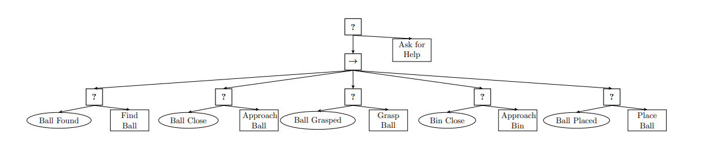

# Behavior Tree Simple Demo
This demo builds a behavior tree  for grasp and place robot from scratch in C++ using [BehaviorTree.CPP](https://www.behaviortree.dev/)

## Behavior Tree

It was made in service of [this](https://www.youtube.com/watch?v=T_Q57-audMk&t=54s) tutorial video on Youtube.

Note - This branch uses BehaviorTree.CPP V4, which was released after the YouTube Series using V3 was put out. Thus, there are minor changes. After watching the video, please compare with this branch if you're using V4. To use V3, switch to the branch `behavior_tree_v3`

The video and this demo was inspired by the book [Behavior Trees in Robotics and AI](https://arxiv.org/abs/1709.00084)
