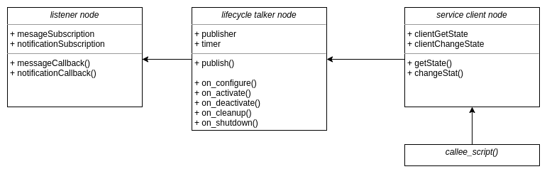

# Lifecycle Node Demo
This demo builds a lifecycle publisher in ROS 2 from scratch and demonstrates the use by building a subscriber and service client.

## System Design

It was made in service of [this](https://www.youtube.com/watch?v=axraRVgFRec&t=210s) tutorial video on Youtube.
